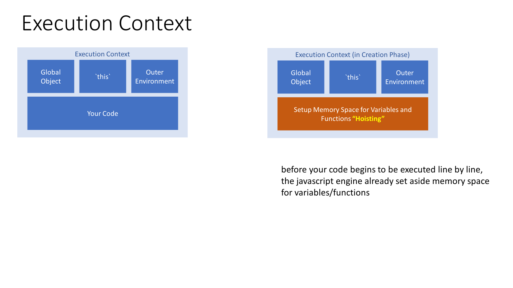
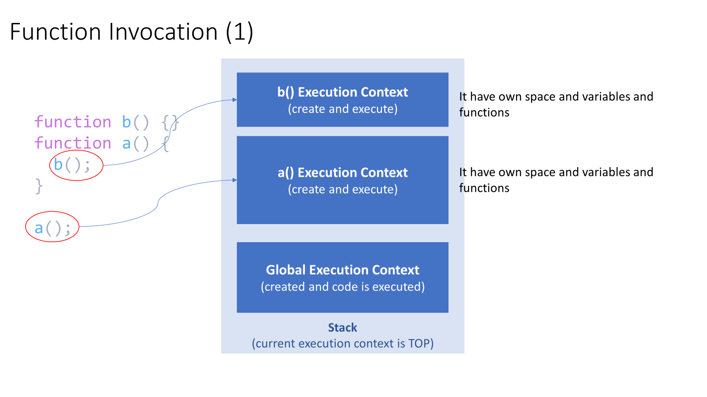
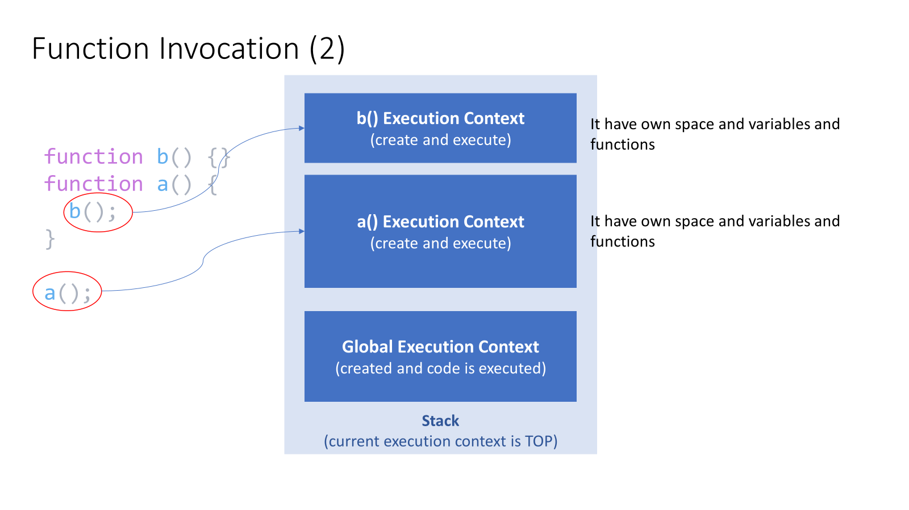

+++
title = 'Execution context in Javascript'
date = 2024-02-20
+++

### Setup

- Chrome
- https://brackets.io/ or VS Code (With Live Server Extenstion)

### BIG WORDS ALERT

- Systax Parser
- Lexical Environment
- Execution Context

### Global Environment and Global Object

- When code is run in Javascript, it run inside `Execution Context` (Global)
- `Execution Context` create 2 things:
  - `Global Object`: in browers is `window` (different than `nodeJS`).
    If we have a seperate tab that would be a seperat3e `global object` (each tab is hold a `Execution Context`)
  - `this`
- `Global` mean:
  - Not inside a Function

### Creation and Execution Phase (by Javascript Engine)



- Phase 1: Creation 3 things and setup memory space (at creation time)

  - `Global Object`
  - `this`
  - `Outer Environment`

  Then the **parser** will go thought your code for translation: to recognize **where** your created variables and **where** you created functions.

  - Hoisting (setup memory space)
    **before your code begins to be executed line by line, the javascript engine already set aside memory space for variables/functions**
    Functions are entirely is placed into memory space: **function name, function code** (then we can call the function **before** declaration)

## ExecutionContext of function is Created (CREATION PHASE)



flowchart
A["Variable Environment"]
B["this"]
C["Outer Environment"]
D["this will be changed depend on how function is call"]

subgraph Execution Context is create
direction TB
A
B
C
D-->B
end

style D fill:none



- Phase 2: Execution time.
  The code will be execution line by line

```js
b(); // We can call b function rightnow. Printout: called b
console.log(a); // We can use `a` variable (because in the creation phase, a will be availabe, but the value will be setup is `undefined`

var a = "Hello World"; // In execution time, a will be setup is "Hello World"

function b() {
  console.log("called b");
}
```

### Single Thread and Synchronous Execution

- Javascript behave Single Thread/Synchronous Execution: One at a time

### Function Invocation and Execution Stack

- Function Invocation: by using ()





```js
function b() {}
function a() {
  b();
}

a();
```

- Step 1: Create `Global Execution Context` and setup memory space

  - `b`, `a` will be in memory

- Step 2: Execute the code line by line.
  - Hit `a()`: invoke function `a`

```js
function a() {
  b();
  var c;
}

function b() {
  var d;
}

a();
var d;
```

- Step 1: create `Global Execution Context`:

  ```js
  GlobalExecutionContext = { a: f, b: f, d: variable };
  Stacks = [GlobalExecutionContext];
  ```

- Step 2: hit `a()` invoke function `a`. Then `Execution Context` of a will be created

  ```js
  ExecutionContext(a) = {c: variable, }
  Stacks = [GlobalExecutionContext, ExecutionContext(a) <- current]
  ```

  Then execute `a()` line by line >> hit b()

- Step 3: hit `b()`

  ```js
  ExecutionContext(b) = {d: variable}
  Stacks = [GlobalExecutionContext, ExecutionContext(a), ExecutionContext(b)  <- current]
  ```

- Step 4:

  - Finish `b()` >> popup `ExecutionContext(b)` of `Stacks`

  ```js
  Stacks = [GlobalExecutionContext, ExecutionContext(a), ExecutionContext(b) <- pop up];

  Stacks = [GlobalExecutionContext, ExecutionContext(a)];
  ```

  - Then finish `a()`:

  ```js
  Stacks = [GlobalExecutionContext, ExecutionContext(a) < -popup];
  Stacks = [GlobalExecutionContext];
  ```

### Functions, Context and Variable Environments

- Variable Environment: **WHERE** variable LIVE

- What is `myVar` in anypoint time ? >> Scope

```js
// Step 3: b() is invoke

// GlobalExecutionContext = {myVar: 1}
// ExecutionContext(b) = {myVar: undefined}
// Stacks = [GlobalExecutionContext, ExecutionContext(a), ExecutionContext(b)]

function b() {
  var myVar;
  console.log(myVar);
}

// Step 2: a() is invoked
// GlobalExecutionContext = {myVar: 1}
// ExecutionContext(a) = {myVar: 2}
// Stacks = [GlobalExecutionContext, ExecutionContext(a)]
function a() {
  var myVar = 2;
  console.log(myVar);
  b();
}

// Step 1
// GlobalExecutionContext = {myVar: 1}
// Stacks = [GlobalExecutionContext]
var myVar = 1;
console.log(myVar);

a();
```

### SCOPE CHAIN

- Javascript Engine don't look ONLY the current execution context
- Every `ExecutionContext` has `Outer Environment`.
  In the bellow case, both of `ExecutionContext(a)` and `ExecutionContext(b)` have Outer Environment are `GlobalExecutionContext`:

  > ExecutionContext(a).outerEnv = ExecutionContext(b).outerEnv = GlobalExecutionContext

  Although `a` function invoke `b` function (Execution(a) is below Execution(b) in stacks) BUT `b` is sitting on the same code with `a`, they refer the same global execution context (`lexical enviroment`). This one is setup at the code (creation time), not the calling time

- Scope chain: the links of `outer environment` references. `Outer Environment`: physically, where is code is setting
  `outer environment` refer to **WHO** create me ?

```js
function b() {
  // ExecutionContext(b) = {}
  // ExecutionContext(b).outerEnvironment (lexical) = GlobalExecutionContext
  console.log(myVar);
}

function a() {
  // ExecutionContext(a) = {myVar: 2}
  // ExecutionContext(a).outerEnvironment (lexical) = GlobalExecutionContext

  var myVar = 2;
  console.log(myVar);
  b();
}

// GlobalExecutionContext = {myVar: 1}
var myVar = 1;
console.log(myVar);

a();
```

- Now we change scope lexical environment of function b: put inside function a

```js
function a() {
  // ExecutionContext(a) = {myVar: 2}
  // ExecutionContext(a).outerEnvironment (lexical) = GlobalExecutionContext

  function b() {
    // ExecutionContext(b) = {}
    // ExecutionContext(b).outerEnvironment (lexical) = ExecutionContext(a)
    console.log(myVar);
  }

  var myVar = 2;
  console.log(myVar);
  b();
}

// GlobalExecutionContext = {myVar: 1}
var myVar = 1;
console.log(myVar);

a();
```

### `let` - block scoping

- Block begin/end at {}:
  - If statement
  - For..loop

### What about asynchronous callbacks ?

- Since Javascript is synchronous, how this handle `asynchorous` events ?


flowchart LR
A("Rendering Engine")<-->B("Javascript Engine (synchronous only)")
B<-->C("HttpRequest")




flowchart LR
subgraph stack
direction RL
A("b() Execution Context<br>(create and execute)")
B("a() Execution Context<br>(create and execute)")
C("Global Execution Context<br>(create and execute)")
end

subgraph eventQ["Event Queue"]
E("Click")
F("Http request")
end
stack <--push function handle of event (clickHandler)-->E
stack <--push function handle of event (HttpRequestHandler)-->F



- Javascript engine won't look at the `event queue` untill `stack` is empty

### Types

- Javascript use **Dynamic Typing**

```js
var isNew = true; // No errors
isNew = "yup !";
isNew = 1;
```

- Primitive types
  - Type of data that represents a single value
  - `undefined`: variable is not set (by JS Engine). Not recomment to set manually
  - `null`: can be set manually.
  - `boolean`: `true` | `false`
  - `number`
  - `string`
  - `symbol` (ES6)

### Operators

- Operators: a specical functions take 2 parameters and return 1 result
- `infix` notation: `+(3, 4) = 3 + 4`

### References:

- https://www.reddit.com/r/reactjs/comments/14pj7ej/a_deep_dive_into_react_fiber_and_source_code/
