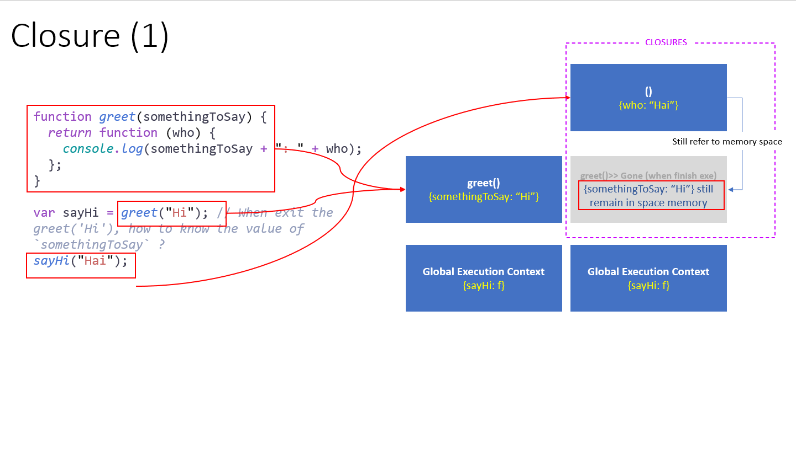
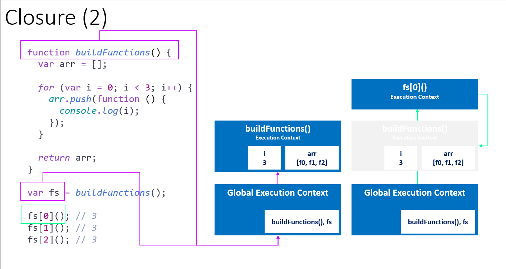

+++
title = 'Objects and Functions'
date = 2024-02-20
+++

### Objects

- How objects are live in memory:
  They are siting in memory and keep the reference to others (keep in memory also)


graph LR
A["Object <br> 0x001"] --> B["Primitive 'Property'<br> 0x002"]
A --> C["Object Property = collection of name/value pairs<br> 0x003"]
A --> D["function = method<br> 0x004"]


### Namespace:

- Keep `variables` and `functions` with name seperate
- Javascript doesn't have namespaces

```js
var greet = "Hello !";
var greet = "HOLLA !";

console.log(greet);

// In the case multi language, we can use object wrapping the functions/properties
var english = {};
var spanish = {};

english.greet = "Hello";
spanish.greet = "Holla"; // Can be used without collision
```

### JSON and Object literal

- JSON has stricter rule than `Object Literal`:
- Properties need to have quotes

```js
var objectLiteral = {
  firstName: "Ho",
  lastName: "Hai",
};

console.log(JSON.stringify(objectLiteral));

var jSonValue = JSON.parse('{"firstName":"Ho","lastName":"Hai"}');
console.log(jSonValue);
```

### Functions are objects

- First class Functions: Everything you can do with **other types**, you can do with **functions**.
  Assign a function to variable, pass it...

  ```js
  function greet() {
    console.log("Hello: ");
  }
  // Can attach new property
  greet.language = "english";
  ```

- **Functions** are reside in memory. They are **objects**, then we can attach: primitive, object, function...


graph LR
A["<b>Function</b><br>a sepecial type of object"] --attach--> B["Primitive"]
A--attach property-->C["object"]
A--attach property-->D["function"]

A--has special property-->E["<b>__NAME__</b><br>optional, can be anonymous"]
A--has special property-->F["<b>__CODE__</b>"]
F-.when invoke().->G["(.)"]

style E fill:#00758f
style F fill:#00758f



### Function statements and Function Expressions

- `Expression`: A unit of code that results in a value

```js
// Function statement
function greet() {
  console.log("Hi");
}

// Function expression:
// Javascript Engine will execute the expresion
// function () {
//  console.log("Hi");
// };
// which one will be return the function pointer, then we assign the name of function pointer is `anonymousGreet`

var anonymousGreet = function () {
  console.log("Hi");
};

greet();
anonymousGreet();
```


flowchart

subgraph P1["Phase1: creation time"]
A["function greet() {<br>console.log('hi')<br>}"]---->B["<b>Function object</b><br>a special type of object"]
G["function greet() {<br>console.log('hi')<br>}"]---->H["<b>Function object</b><br>a special type of object"]

B---->C["<b>__NAME__</b><br>greet"]
B---->D["<b>__CODE__</b><br>console.log('hi)"]

H---->HN["<b>__NAME__</b><br>anonymous"]
H---->HC["<b>__CODE__</b><br>console.log('hi)"]

subgraph Mem["Memory Space"]
B
H
end

subgraph ExecutionContext["ExecutionContext"]
I["greet"] ---> B
K["anonymousGreet"] ----> H
end

end

subgraph P2["Phase 2: execution time"]
I---->E["greet()"]
K ----> L["anonymousGreet()"]
B--pull the object from memory-->E

E--get **CODE** of object-->F["__CODE__ is run"]
L--get **CODE** of object-->M["__CODE__ is run"]

end

style A fill:#4287f5,text-align:left
style P1 fill:#aceefa
style Mem fill: #32a2a8



### By Value and By Reference



flowchart
1["a"] --0x001--> 2["Primitive Value"]
3["b=a<br> (or pass to a function)"]
4["b"] --0x002-->5["Copy of Primitive Value"]

style 3 fill:none




flowchart
1["a"] --0x001--> 2["Objects <br>(including functions)"]
3["b=a<br> (or pass to a function)"]
4["b"] --0x001 <br> (point same address)-->2

style 3 fill:none


### `this` keywords

- `this` will be created at the creation phase. In this case, `this` will refer to global object

```js
function a() {
  console.log(this); // `this` refer to global object
  // Attact new attribute into this global object
  this.newVariable = "Hello";
}

a();

console.log(this);
console.log(newVariable); // Display "Hello"
```

- For the function is invoked, the new `ExecutionContext` is created and Javascript decide what is `this` keyword refer to.

```js
var c = {
  name: "The C object",
  log: function () {
    console.log(this);
  },
};

c.log(); // Func log is invoked >> ExecutionContext(log) is create (and `this` will be refer to the object c)
```

- Becarefull the `this` reference in the nested function

```js
var c = {
  name: "The C object",
  log: function () {
    this.name = "Updated c object"; // `this` refer to the c object

    var setName = function (newName) {
      this.name = newName; // NOT WORK !!! `this` refer to global object
    };

    setName("Updated c object again !!!");
    console.log(this);
  },
};

c.log();
```

To fix this, we can use the pattern `self = this`

```js
var c = {
  name: "The C object",
  log: function () {
    var self = this;
    self.name = "Updated c object"; // `this` refer to the c object

    var setName = function (newName) {
      self.name = newName; // NOT WORK !!! `this` refer to global object
    };

    setName("Updated c object again !!!");
    console.log(self);
  },
};

c.log();
```

### `arguments` and spread

## 

## title: ExecutionContext of function is Created (FUNCTION)

flowchart
A["Variable Environment"]
B["this"]
C["Outer Environment"]
D["this will be changed depend on how function is call"]
E["arguments"]
F["Contain all of parameters you pass to function"]

subgraph Execution Context is created
direction TB
A
B
C
D-->B
F-->E
end

style D fill:none
style F fill:none
style E fill:#42f5a7


```js
function greet(firstName, lastName, language) {
  console.log(arguments);
  console.log("-------------------");
}

greet();
greet("ho");
greet("ho", "hai");
greet("ho", "hai", "en");
```

- Spread:

```js
function greetWithSpread(...others) {
  console.log(others);
}

greetWithSpread("hai"); // ['hai']
greetWithSpread("hai", 1); // ['hai', 1]
greetWithSpread("hai", 1, { street: "HaNoi" }); // ['hai', 1, {…}]
```

### Immediately Invoked Function Expressions (IIFEs)

```js
// Using an Immediately Invoked Function Expression (IIFE)
var greeting = (function (name) {
  console.log("hello " + name);
})("hai");

// Trick syntax parser

(function (name) {
  console.log("Hola: " + name);
})("hohai");
```


### Understanding Closures





```js
function buildFunctions() {
  var arr = [];

  for (var i = 0; i < 3; i++) {
    arr.push(function () {
      console.log(i);
    });
  }

  return arr;
}

var fs = buildFunctions();

fs[0](); // 3
fs[1](); // 3
fs[2](); // 3
```

```js
function createSomeWeird() {
  let obj = {};

  return {
    inner: obj,
    displayInner: function () {
      console.log(obj);
    },
  };
}

let weirdObj = createSomeWeird();
weirdObj.inner.name = "Weird Object Here";
weirdObj.displayInner();
```

### `call()`, `apply()`, `bind()`

- 3 methods are the ways we control the **`this` object** in Function Execution Context

- `bind()`: setup new **COPIED** method and bind the `this` object with binded object

```js
var person = {
  firstName: "Ho",
  lastName: "Hai",

  getFullName: function () {
    return this.firstName + " " + this.lastName;
  },
};

var logFunc = function (lang1, lang2) {
  console.log("Loged: " + this.getFullName()); // Error
};

var logFuncName = logFunc.bind(person);

logFuncName("en");
```

- `call()`: NOT COPY, JUST EXECUTE and assign `this` object in the first parameter

```js
logFunc.call(person, "en", "es");
```

- `apply()`: same to `call()` except the way we pass in arguments (put them in array)

```js
logFunc.call(person, ["en", "es"]);
```

- Use case `function borrowing`

```js
var person2 = {
  firstName: "John",
  lastName: "Doe",
};

person.getFullName.apply(person2);
```

- Use case `function curring`: create a copy of a function but with some preset parameters.
  Beside the setting `this` object, we can set the aruguments (**partly**)

```js
function multiple(a, b) {
  return a * b;
}

var multipleByTwo = multiple.bind(this, 2); // Beside the setting `this` object, we can set the aruguments (partly)

// Do the same things
var multipleByTwoV2 = function (b) {
  return multiple(2, b);
};

console.log(multipleByTwo(5));
console.log(multipleByTwoV2(5));
```

### Functional Programming

```js
function mapForEach(arr, fn) {
  var returnedArr = [];
  for (var i = 0; i < arr.length; i++) {
    returnedArr.push(fn(arr[i]));
  }

  return returnedArr;
}

var arr = [1, 2, 3];

var arr2 = mapForEach(arr, function (item) {
  return item * 2;
});

var checkLimit = function (limitation, item) {
  return item > limitation;
};

var arr3 = mapForEach(arr, checkLimit.bind(this, 1)); // Preset limitation = 1

console.log(arr3);

var checkLimitSimplified = function (limitation) {
  return function (item) {
    return item > limitation;
  };
};

var arr4 = mapForEach(arr, checkLimitSimplified(2));

console.log(arr4);

// var checkLimitV2 = function (limiter) {
//   return function (arr) {
//     return mapForEach(arr, function (item) {
//       return item > limiter;
//     });
//   };
// };

// console.log(checkLimitV2(2)(arr));
```
