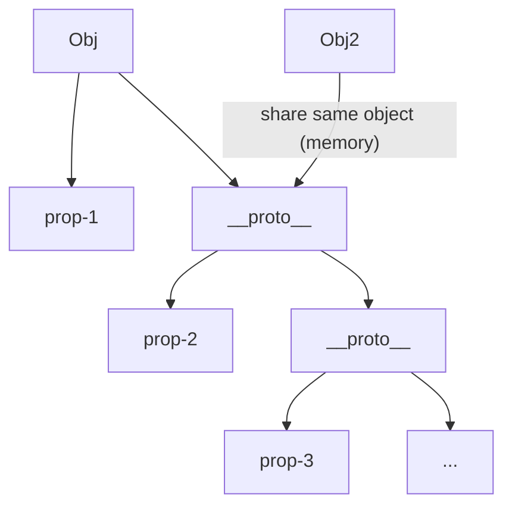
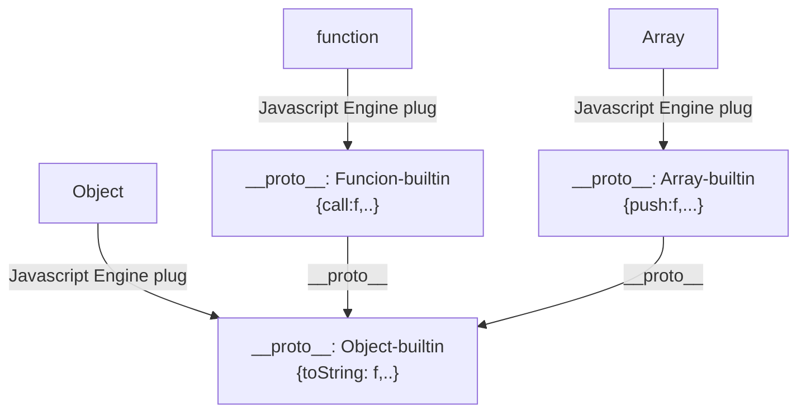
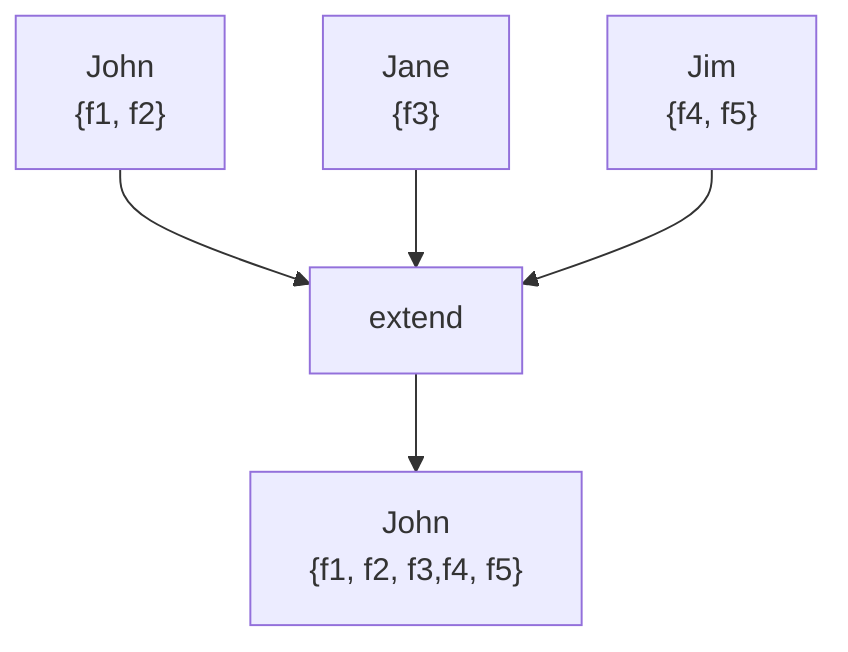

### Classical Inheritance vs Prototype Inheritance

- Classical Inheritance: like C#, Java...
- Prototypal Inheritance: Javascript

### Prototype

- Prototype chain: the links that Javascript can search from current object to `__proto__` parent object (and so on)

### Everthing is an Object (or a primitive)

### Reflection and Extend

- Reflection: An object can look at **itself**, listing and changing its properties and methods
- Extend: some kind of composition by copied properties and method of source project to destinition. In `Underscore.js` we can user `_.extend(des, source1, source2...)`

