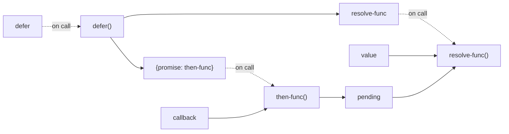
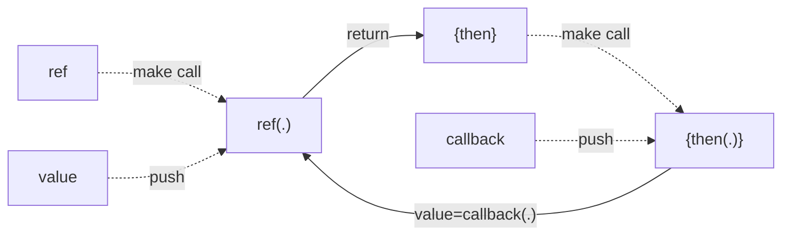

+++
title = 'Advance Javascript (Part 3)'
date = 2023-12-21T07:07:07+01:00
draft = false
+++

### Contructors with Prototypes

- class was introducted in ES2015

```js
class Car {
  constructor(model, year) {
    this.model = model;
    this.year = year;
  }
  // Should be move to Car.prototype object then all of Car instances will
  // be refer to same this function object
  // toString() {
  //   console.log(`${this.model} has ${this.year}`);
  // }
}
// All of Car instances wil be refer to same this function object
Car.prototype.toString = function () {
  console.log(`${this.model} has ${this.year}`);
};
```

### Module pattern (Closure)


```js
var F = function () {
  var obj1 = { name: "hohai", age: 40 };
  var value1 = 123;

  // At F2 CREATION (NOT CALLING), [[scopes]] of F2 will be capture
  function F2() {
    console.log("In F2, refer to outer scopes: obj1, value1 ");
    obj1.age += 1;
    value1 += 1;
    console.log(obj1);
    console.log(value1);

    return "Finished Called F2";
  }

  function F3() {
    console.log("In F3, refer to outer scopes: F2, value1 ");
    F2();
    value1 += 1;
    console.log(value1);
    return "Finished Called F3";
  }

  //   return obj1; { name: "hohai", age: 40 }
  //   return value1; // 123
  return F2;
  //   return F3();
};

// var test = F();
// console.log(test());
// console.log(test());
// console.log(test());

var test = F();
console.log(test);
console.log(test);
console.log(test);
```

```js
var myModule = (function () {
  var count = 0;

  return {
    increment() {
      return ++count;
    },

    reset() {
      count = 0;
      return count;
    },
  };
})();

console.log(myModule.count); // Undefine

console.log(myModule.increment());
console.log(myModule.increment());
console.log(myModule.increment());

console.log(myModule.reset());

console.log(myModule.increment());
console.log(myModule.increment());
```

**Note**:
https://jesseduffield.com/Everything-I-Wish-I-Knew-About-JS-Scoping-A-Week-Ago/

- The module is load as an object, we can view the content of code as logic of this object.

```js
// In module `test4.mjs`

let count = 0;

let increaseAndMakeConsumerCounter = function () {
  count++;
  return {
    consume: reduceAndConsoleConsumer,
  };
};

let reduceAndConsoleConsumer = function () {
  console.log(`Current count is: ${count}. Then we will reduce it`);
  count--;
};

export { increaseAndMakeConsumerCounter };

// In `usage-test4.mjs`
import { increaseAndMakeConsumerCounter } from "./test4.mjs";

const consumer1 = increaseAndMakeConsumerCounter();
const consumer2 = increaseAndMakeConsumerCounter();

consumer1.consume(); // Current count is: 2. Then we will reduce it
consumer2.consume(); // Current count is: 1. Then we will reduce it
consumer1.consume(); // Current count is: 0. Then we will reduce it
```

### Reavealing Module Pattern

- In `pattern-module.mjs`: export the object wrapping all of methods, values we want to expose to other modules

```js
let counter = 0;
const PRIVATE_VALUES = "HOHAI";

const increaseFn = function () {
  counter++;
};

const getCurrenFn = function () {
  return counter;
};

const realingModule = {
  value: PRIVATE_VALUES,
  incFunc: increaseFn,
  getCurrentFunc: getCurrenFn,
};

export default realingModule;
```

- In the `usage-1.mjs`:
  - Try to import the object `realingModule` then try to run method in this object
  - Try to run methods `run4Times`
  - Export `run4Times` method object that other can be use

```js
import realingModule from "./pattern-module.mjs";

const run4Times = function () {
  realingModule.incFunc();
  realingModule.incFunc();
  realingModule.incFunc();
  realingModule.incFunc();
  console.log(realingModule.getCurrentFunc());
};

run4Times();
export { run4Times, realingModule };
```

- In `usage-2.mjs` try to import `run4Times` from `usage-1.mjs`:
  - `run4Times()` in `usage-1.mjs` will be executed when import
  - `run4Times()` in `usage-2.mjs` will be execute (and modify the same object `realingModule`)

```js
import realingModule from "./pattern-module.mjs";
import { realingModule as realingModuleM1 } from "./usage-1.mjs";

console.log(realingModule.getCurrentFunc());

console.log(realingModuleM1 === realingModule); // True: SAME OBJECT
```

### Pub/Sub pattern

```js
var pubsub = {};

(function (q) {
  var topics = {};
  var subUid = -1;

  // Publish or broadcast events of interest with a specific topic name and arguments such as the data to pass long
  q.publish = function (topic, args) {
    if (!topics[topic]) return false;

    var subcribers = topics[topic];
    var len = subcribers ? subcribers.length : 0;

    while (len--) {
      subcribers[len].func(topic, args);
    }

    return this;
  };

  // Subcribe to events of interest with a specific topic name and callback function, to be executed when topic/event is observerd
  q.subcribe = function (topic, func) {
    if (!topics[topic]) topics[topic] = [];

    var token = (++subUid).toString();

    topics[topic].push({
      token: token,
      func: func,
    });

    return token;
  };

  // Unscribe

  q.unsubcribe = function (token) {
    for (var topic in topics) {
      for (var i = 0, j = topics[topic].length; i < j; i++) {
        if (topics[topic][i].token === token) {
          topics[topic].splice(i, 1);
          return token;
        }
      }
    }

    return this;
  };
})(pubsub);

// Example 1: Test basic use of publishers and subcribers
/*
var testHandler = function (topic, data) {
  console.log(topic + ": " + data);
};

var testSubcription = pubsub.subcribe("example1", testHandler);
pubsub.publish("example1", "Hello world !");
pubsub.publish("example1", ["Test", "a", "b"]);
pubsub.publish("example1", { color: "blue", bg: "yellow" });

console.log(testSubcription);
*/

// Example 2: UI notification using pub/sub
/*
- Subriber is listening the topic 'dataUpdated' when new stock information is available
- Trigger 'gridUpdate'
*/

var grid = {
  refreshData: function () {
    console.log("retrieved the lastest data from data cache");
    console.log("updated grid component");
  },

  updateCounter: function () {
    console.log("data last updated at...: ");
  },
};

var gridUpdate = function (topic, data) {
  grid.refreshData();
  grid.updateCounter();
};

var dataSubcription = pubsub.subcribe("dataUpdated", gridUpdate);
pubsub.publish("dataUpdated", "New stock data avaialble");
pubsub.publish("dataUpdated", "New stock data avaialble");
```

### Pub/Sub pattern (other implementation)

```js
const event = {
  list: new Map(),
  on(eventType, eventAction) {
    this.list.has(eventType) || this.list.set(eventType, []);
    if (this.list.get(eventType)) this.list.get(eventType).push(eventAction);
    return this;
  },

  emit(eventType, ...args) {
    this.list.get(eventType) &&
      this.list.get(eventType).forEach((cb) => {
        cb(...args);
      });
  },
};

export default event;
```

### Prototype pattern

Copy the properties/attribute of object

- Use `Object.create`
- Or using `prototype`
  - `makeCopy` = `makeCopy2` = `Object.create`

```js
var makeCopy = (function () {
  function F() {}

  return function (proto) {
    F.prototype = proto;
    return new F();
  };
})();

var makeCopy2 = function (proto) {
  function F() {}
  F.prototype = proto;
  return new F();
};

// var car3 = Object.create(car0);
var car3 = makeCopy(car0);
var car4 = makeCopy2(car0);

console.log(car3.feature1);
console.log(car4.feature1);
```

- Implement Protytpe pattern by class

```js
const beget = () => {
  class F {
    constructor() {}
  }
  return (proto) => {
    F.prototype = proto;
    return new F();
  };
};
```

### Flyweight pattern

Consider Library Book System Management

- Manager checkout of books

```js
var Book = function (id, title, checkoutMember, dueReturnDate, availabity) {
  // Instrict information
  this.id = id;
  this.title = title;

  // Exstrict information
  this.checkoutMember = checkoutMember;
  this.dueReturnDate = dueReturnDate;
  this.availabity = availabity;
};

Book.prototype = {
  getTitle: function () {
    return this.title;
  },

  updateCheckoutStatus: function (bookID, newStatus) {
    this.id = bookID;
    this.availabity = newStatus;
  },
};
```

When the library have many books >> the data of book will be over memory

- Then we can seperate `instrict`/`extrict` information of a book
- **Becarefull** we have 2 checkout versions. The `prototype` version will be more effective than the object version because it save the memory (remove the function objects by sharing the same one)

```js
var Book = function (id, title) {
  // Instrict information
  this.id = id;
  this.title = title;

  // Exstrict information
  //   this.checkoutMember = checkoutMember;
  //   this.dueReturnDate = dueReturnDate;
  //   this.availabity = availabity;
};

Book.prototype = {
  getTitle: function () {
    return this.title;
  },

  //   updateCheckoutStatus: function (bookID, newStatus) {
  //     this.id = bookID;
  //     this.availabity = newStatus;
  //   },
};

var Book = function (id, title) {
  // Instrict information
  this.id = id;
  this.title = title;

  // Exstrict information
  //   this.checkoutMember = checkoutMember;
  //   this.dueReturnDate = dueReturnDate;
  //   this.availabity = availabity;
};

Book.prototype = {
  getTitle: function () {
    return this.title;
  },

  //   updateCheckoutStatus: function (bookID, newStatus) {
  //     this.id = bookID;
  //     this.availabity = newStatus;
  //   },
};

var BookCheckout = function (book) {
  return {
    checkoutMember: function () {
      console.log(book.id + " is checkout");
    },

    dueReturnDate: function (date) {
      console.log(book.id + " will be return at : " + date);
    },
  };
};

var BookCheckoutV2 = function (book) {
  this.book = book;
};

BookCheckoutV2.prototype = {
  checkoutMember: function () {
    console.log(this.book.id + " is checkout");
  },

  dueReturnDate: function (date) {
    console.log(this.book.id + " will be return at : " + date);
  },
};

var hohaiBook = new Book(123, "HoHai Book");
BookCheckout(hohaiBook).checkoutMember();
BookCheckout(hohaiBook).dueReturnDate(new Date());
// There are 2 objects
console.log(BookCheckout(hohaiBook) === BookCheckout(hohaiBook)); // Return false
// And there are 2 function objects do the same thing >> Not effective
console.log(
  BookCheckout(hohaiBook).checkoutMember ===
    BookCheckout(hohaiBook).checkoutMember
); // return false

var bookCheckoutV2 = new BookCheckoutV2(hohaiBook);
bookCheckoutV2.checkoutMember();
bookCheckoutV2.dueReturnDate(new Date());
var bookCheckoutV2Other = new BookCheckoutV2(hohaiBook);
// There are 2 objects
console.log(bookCheckoutV2 === bookCheckoutV2Other);
// But refer same function objects (due refer same prototype property)
console.log(
  bookCheckoutV2.checkoutMember === bookCheckoutV2Other.checkoutMember
);
```

### Pattern MVVM

- Implement `pub/sub` patter (`observable`)
- Implement decorator using `prototype`
  - The `this` keyword will refer to the returned object (after `new` later). To refer `this` object we created refer variable `self` to refer `this` object, then we can use in the nested method

```js
// May be we can improve by using prototype property to attact the
// methods (subcribe, notify).

function observable(value) {
  // Notify to subcribles when change
  // Automatic detect dependencies

  // I will make simple implementation of KnockoutJS
  const subcribers = [];
  var currentValue = value;

  const notify = function (newValue) {
    subcribers.forEach((fn) => {
      fn(currentValue, newValue);
    });
  };

  return {
    value: currentValue,
    subcribe: function (fn) {
      subcribers.push(fn);
    },

    change(newValue) {
      notify(newValue);
      currentValue = newValue;
    },
  };
}

var observableV2 = function (value) {
  // Init the data only
  this.currentValue = value;
  this.subcribers = [];
};

// Attact behaviors only
observableV2.prototype = {
  subcribe: function (fn) {
    this.subcribers.push(fn);
  },

  change(newValue) {
    var self = this; // Litte hack, this will refer to the returned object
    const notify = function (newValue) {
      self.subcribers.forEach((fn) => {
        fn(self.currentValue, newValue);
      });
    };

    notify(newValue);
    self.currentValue = newValue;
  },
};

// Model layer: contain the data only. Don't have format feature
// The format features shoule be put in View layer
var Todo = function (content, done) {
  this.content = observable(content);
  this.done = observable(done);
  this.editing = observable(false);
};

var TodoV2 = function (content, done) {
  this.content = new observableV2(content);
  this.done = new observableV2(done);
  this.editing = new observableV2(false);
};

var todo1 = new Todo("A", false);
todo1.content.subcribe(function (currentValue, newValue) {
  console.log("Function 1: on " + currentValue + " changed to " + newValue);
});
todo1.content.subcribe(function (currentValue, newValue) {
  console.log("Function 2: on " + currentValue + " changed to " + newValue);
});

todo1.content.change("B");

var todo2 = new TodoV2("A", false);
todo2.content.subcribe(function (currentValue, newValue) {
  console.log("Function 1: on " + currentValue + " changed to " + newValue);
});
todo2.content.subcribe(function (currentValue, newValue) {
  console.log("Function 2: on " + currentValue + " changed to " + newValue);
});

todo2.content.change("B");
```

### Namespace injection

```js
var ns1 = ns1 || {};
var ns2 = ns2 || {};

var moduleCreator = function (val) {
  var val = val || 0;

  // Inject methods of `this` module/namespace object
  this.inc = function () {
    return ++val;
  };

  this.reset = function () {
    val = 0;
  };
};

moduleCreator.call(ns1); // `this` will be ns1
moduleCreator.call(ns2, 5000); // `this` will be ns2

console.log(ns1.inc());
console.log(ns2.inc());
```

### Module pattern in jQuery

```js
// Module Pattern
// Private API: hold any code we don't wish to expose
// Public API: will be allowed to interact

(function (exports, $, undefined) {
  var Plugin = function () {
    // Our private API
    var priv = {};

    // Our public API
    var Plugin = {};
    var defaults = {};

    // Private options and methods
    priv.options = {};
    priv.method1 = function () {};
    priv.method2 = function () {};

    // Public methods
    Plugin.method1 = function () {};
    Plugin.method2 = function () {};

    // Public initialization
    Plugin.init = function (options) {
      $.extend(priv.options, defaults, options);
      priv.method1();
      return Plugin;
    };

    // Return the public API (Plugin) we want to expose
    return Plugin;
  };

  exports.Plugin = Plugin;
})(this, jQuery);
```

### Lazy Initialization Pattern (in jQuery)

- `ready` function will be called when DOM is ready

```js
$(document).ready(function () {
  // The ajax request won't attempt to execute until the DOM is ready
  var jqxhr = $.ajax({
    url: "http://domain.com/api",
    data: "some data",
  }).done(function (data) {
    $(".status").html("content loaded");
    console.log("Data output: " + data);
  });
});
```

### Composite Pattern (in jQuery)

- Describes a **group of objects** that can be treated in same way **single instance** of an object

```js
// Single elements
$("#singleItem").addClass("active");
$("#containerItem").addClass("active");

// Collection of elements
$("div").addClass("active");
```

### Adapter Pattern (in jQuery)

- Translate **an interface** a class into an **interface compatible** with a specific system
- Example of jQuery is usage `$(el).css` method

```js
$(".container").css({ opacity: 0.5 });
```

### Facade Pattern (in jQuery)

- An object providers a simpler interface

```js
$.get(url, data, callback, dataType);
$.post(url, data, callback, dataType);

// Translate like these
$.get = function (url, data, callback, dataType) {
  return $.ajax({
    type: "GET",
    url: url,
    data: data,
    dataType: dataType,
  }).done(callback);
};
$.post = function (url, data, callback, dataType) {
  return $.ajax({
    type: "POST",
    url: url,
    data: data,
    dataType: dataType,
  }).done(callback);
};
```

### Observer Pattern (in jQuery)

- **A subject (the Publisher)** keep list of its dependencies, and notify them automatically anytime something interesting happens

```js
// Equivalent to subcribe(topicName, callback)
$(document).on("topicName", function () {
  // Perform some behavior
});
// Equivalent to publish(topicName)
$(document).trigger("topicName");

// Equivalent to unsubcribe(topicName)
$(document).off("topicName");
```

### Iterator Pattern (in jQuery)

- Traverse all of elements of a collection
- We can implement by self

```js
var $ = {};

$.each = function (arr, fn) {
  for (var i = 0; i < arr.length; i++) {
    fn(i, arr[i]);
  }
};

$.each(["hohai", "john"], function (index, value) {
  console.log(index + ": " + value);
});
```

### Strategy Pattern

- Select a particular algorihm at runtime
- Demo 1: we can attach the new property `toggle` (function) of an object.  
  The `toggle` function will change (revert) status of `currentValue` which is local state in module scope (`setupToggle`).

```js
var obj = {};

// We can setup different algorithms (toogleFn)
function setupToggle(obj, initValue, toogleFn) {
  var currentValue = initValue;
  obj.toggle = function () {
    currentValue = !currentValue;
    toogleFn(currentValue);
  };
}

setupToggle(obj, false, function (value) {
  console.log("The current of object is: " + value);
});

obj.toggle();
obj.toggle();
obj.toggle();
```

### Promise Implementation

Refer to: https://github.com/kriskowal/q/blob/v1/design/README.md

```js
var Promise = function () {};

var isPromise = function (value) {
  return value instanceof Promise;
};

var defer = function () {
  var pending = [],
    value;
  var promise = new Promise();

  promise.then = function (callback) {
    if (pending) {
      pending.push(callback);
    } else {
      callback(value);
    }
  };

  return {
    resolve: function (_value) {
      if (pending) {
        value = _value;

        for (var i = 0, len = pending.length; i < len; i++) {
          var callback = pending[i];
          callback(value);
        }
      }

      pending = undefined;
    },
    promise: promise,
  };
};

var longOperation = function () {
  var d = new defer();
  d.promise.then(console.log);
  setTimeout(() => {
    d.resolve(123);
  }, 2000);
};

longOperation();
console.log("You can see this line right now !!!");
// You can see this line right now !!!
// 123
```



```js
const ref = function (value) {
  if (value && typeof value.then === "function") return value;

  return {
    then: function (callback) {
      return ref(callback(value));
    },
  };
};

ref(1)
  .then((v) => v + 1)
  .then((v) => v + 1)
  .then((v) => v + 1)
  .then(console.log); // 4
```


